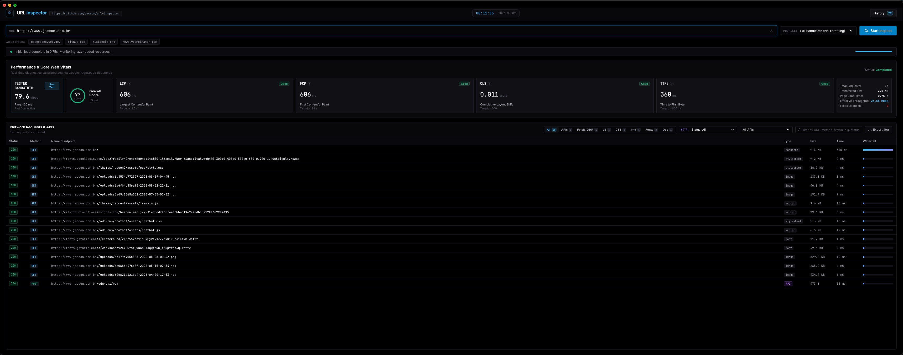

# URL Inspector

High-Performance Desktop Web Diagnostics, Google Core Web Vitals & Network Protocol Analyzer.

[](https://github.com/jaccon/url-inspector)
[](https://www.electronjs.org/)
[](https://nodejs.org/)
[](https://sqlite.org/)
[](tests/)
[](LICENSE)

Created and maintained by **[André Jaccon](https://github.com/jaccon)**.

---



---

## Table of Contents

- [About The Project](#about-the-project)
- [Key Features](#key-features)
- [Architecture & Technology Stack](#architecture--technology-stack)
- [Prerequisites](#prerequisites)
- [Installation & Setup](#installation--setup)
- [Development Workflow](#development-workflow)
- [Testing & Quality Assurance](#testing--quality-assurance)
- [Packaging & Distribution](#packaging--distribution)
- [Metrics & Diagnostic Criteria](#metrics--diagnostic-criteria)
- [Data Storage & Export](#data-storage--export)
- [Contributing](#contributing)
- [Security Policy](#security-policy)
- [Code of Conduct](#code-of-conduct)
- [Authors & Acknowledgments](#authors--acknowledgments)
- [License](#license)

---

## About The Project

**URL Inspector** is an open-source desktop performance engineering application designed for software architects, Site Reliability Engineers (SREs), and frontend developers.

Traditional browser developer tools require manual operation and do not maintain historical run-over-run databases or automated pre-test connection baselines. URL Inspector solves this by embedding a headless Chromium instance controlled via the **Chrome DevTools Protocol (CDP)**, enabling automated page speed diagnostics, network traffic shaping, real-time protocol telemetry, and persistent historical tracking inside a pure dark mode interface.

---

## Key Features

- **Chrome DevTools Protocol (CDP) Telemetry**: Low-level request and response capture directly from the browser engine via `Network`, `Page`, and `Performance` debugging domains.
- **Google Core Web Vitals**: Real-time evaluation of Largest Contentful Paint (LCP), First Contentful Paint (FCP), Cumulative Layout Shift (CLS), and Time to First Byte (TTFB), paired with an overall Lighthouse-weighted performance score.
- **Tester Bandwidth Probing**: Measures client machine download throughput and round-trip ping before computing audit impact, separating client-side constraints from remote server performance.
- **Network Traffic Shaping**: Deterministic emulation of cellular and broadband environments (Full Bandwidth, Broadband 50M, Fast 4G, Slow 4G, Fast 3G, Slow 3G).
- **Protocol & Network Waterfall**: Microsecond timing breakdowns across DNS resolution, TCP connection, SSL/TLS handshake, TTFB server wait, and content download.
- **Multi-Facet Status Code Filtering**: Filter captured network traffic by individual status codes (`200`, `301`, `304`, `404`, `500`) or HTTP response families (`2xx`, `3xx`, `4xx`, `5xx`).
- **API Origin Aggregator**: Real-time separation of first-party application calls from third-party microservices and tracking endpoints.
- **Full-Screen SQLite History**: Embedded WebAssembly SQLite database (`sql.js`) preserving historical execution metrics with instant full-screen review and filtering.
- **Telemetry Export**: One-click generation of structured `.log` and `.txt` audit reports.
- **Lazy-Load Awareness**: Network settling detection prevents premature audit termination on pages with scroll-triggered assets and asynchronous scripts.

---

## Architecture & Technology Stack

- **Runtime**: Electron 30, Node.js 20 (LTS)
- **Protocol**: Chrome DevTools Protocol (CDP) v1.3
- **Database**: SQLite 3 via WebAssembly (`sql.js`)
- **Frontend**: Vanilla JavaScript (ES2022), CSS3 Custom Properties (Design System), HTML5
- **Testing**: Node.js Native Test Runner (`node:test`, `node:assert`)
- **Packaging**: `electron-builder` (macOS Universal/Dual-Arch)

For a detailed breakdown of process boundaries, IPC security, and lifecycle management, see [docs/ARCHITECTURE.md](docs/ARCHITECTURE.md).

```
url-inspector/
├── build/                 # Distribution build resources
├── docs/                  # In-depth architectural documentation
├── src/
│   ├── main/              # Electron main process & CDP auditor
│   ├── preload/           # Context-isolated security bridge
│   ├── renderer/          # Presentation layer and UI controller
│   └── shared/            # Universal mathematical & network utilities
├── tests/                 # Comprehensive unit test suite
├── package.json           # Dependencies and packaging configuration
├── CONTRIBUTING.md        # Contribution guidelines
├── CODE_OF_CONDUCT.md     # Contributor Covenant Code of Conduct
├── SECURITY.md            # Vulnerability reporting process
└── LICENSE                # MIT License
```

---

## Prerequisites

Before running or building URL Inspector, ensure you have the following installed:

- **Node.js**: `v20.x` or higher
- **npm**: `v10.x` or higher
- **Git**: `v2.x` or higher

---

## Installation & Setup

1. **Clone the repository**:
   ```bash
   git clone https://github.com/jaccon/url-inspector.git
   cd url-inspector
   ```

2. **Select Node.js runtime** (if using `nvm`):
   ```bash
   nvm use 20
   ```

3. **Install dependencies**:
   ```bash
   npm install
   ```

---

## Development Workflow

Start the application in development mode:

```bash
npm start
```

Validate JavaScript syntax across all process layers:

```bash
npm run check
```

---

## Testing & Quality Assurance

The test suite runs with zero external test framework dependencies using the Node.js native test runner:

```bash
npm test
```

### Test Suite Coverage:
- **Auditor Lifecycle**: Headless window creation, protocol attachment, timeout guard, and graceful teardown.
- **Metrics Computation**: Core Web Vitals thresholds (Good, Needs Improvement, Poor) and overall score calculation.
- **Network Tracker**: Lifecycle tracking from request sent to response finished, redirect handling, and status code filtering.
- **Speed Tester**: Client throughput calculation, ping measurement, and throttling profile mapping.
- **Database Engine**: SQLite table initialization, CRUD operations, indexing, and eviction safety.

---

## Packaging & Distribution

URL Inspector supports automated packaging for macOS across both Intel and Apple Silicon hardware:

```bash
# Clean previous build artifacts and build both x64 and arm64 packages
npm run build:clean

# Build macOS packages without cleaning
npm run build:mac

# Build unpackaged application bundle only
npm run build:mac:dir
```

### Built Packages in `dist/`:
- **Apple Silicon (M1, M2, M3, M4)**:
  - `dist/URL Inspector-1.0.0-arm64.dmg` (Installable Disk Image)
  - `dist/URL Inspector-1.0.0-arm64-mac.zip` (Portable Archive)
  - `dist/mac-arm64/URL Inspector.app` (Executable Bundle)
- **Intel (x86_64)**:
  - `dist/URL Inspector-1.0.0.dmg` (Installable Disk Image)
  - `dist/URL Inspector-1.0.0-mac.zip` (Portable Archive)
  - `dist/mac/URL Inspector.app` (Executable Bundle)

---

## Metrics & Diagnostic Criteria

Evaluations follow official Google Web Vitals criteria:

| Metric | Full Name | Good | Needs Improvement | Poor |
| :--- | :--- | :--- | :--- | :--- |
| **LCP** | Largest Contentful Paint | $\le 2.5\text{ s}$ | $2.5\text{ s} - 4.0\text{ s}$ | $> 4.0\text{ s}$ |
| **FCP** | First Contentful Paint | $\le 1.8\text{ s}$ | $1.8\text{ s} - 3.0\text{ s}$ | $> 3.0\text{ s}$ |
| **CLS** | Cumulative Layout Shift | $\le 0.10$ | $0.10 - 0.25$ | $> 0.25$ |
| **TTFB** | Time to First Byte | $\le 800\text{ ms}$ | $800\text{ ms} - 1800\text{ ms}$ | $> 1800\text{ ms}$ |

The overall performance score (0 to 100) applies weighted harmonic calculations aligned with Lighthouse v10 methodology.

---

## Data Storage & Export

### SQLite Local Database
- Runs embedded via WebAssembly (`sql.js`), saving directly to the user application directory:
  - macOS: `~/Library/Application Support/url-inspector/audit_history.sqlite`
- Stores timestamp, target URL, overall score, total load duration, encoded bytes, request count breakdown, throttling profile, and individual Core Web Vitals.

### Plaintext Telemetry Export
- Click **Export Log** in the Network Requests card to generate a structured `.log` or `.txt` file containing the complete session telemetry, system environment, and intercepted request headers.

---

## Contributing

Contributions are welcome! Please read our [CONTRIBUTING.md](CONTRIBUTING.md) for details on our code of conduct, development standards, and pull request submission process.

---

## Security Policy

For security advisories or to report a vulnerability, please refer to our [SECURITY.md](SECURITY.md).

---

## Code of Conduct

URL Inspector adopts the Contributor Covenant Code of Conduct. For more information, see [CODE_OF_CONDUCT.md](CODE_OF_CONDUCT.md).

---

## Authors & Acknowledgments

**URL Inspector** was architected and developed by:

- **André Jaccon** — *Lead Architect & Author* — [@jaccon](https://github.com/jaccon)
- **Repository**: [https://github.com/jaccon/url-inspector](https://github.com/jaccon/url-inspector)

---

## License

This project is licensed under the **MIT License** — see the [LICENSE](LICENSE) file for details.
